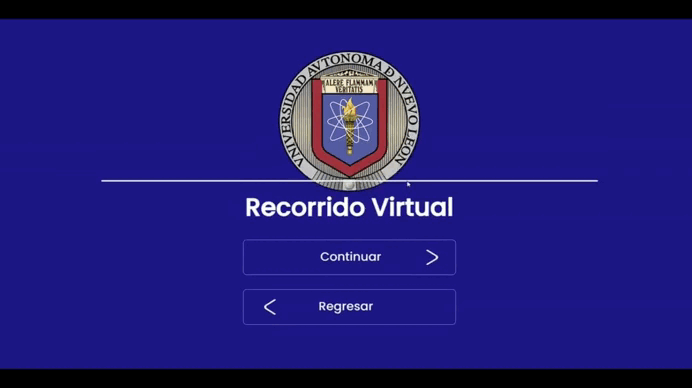
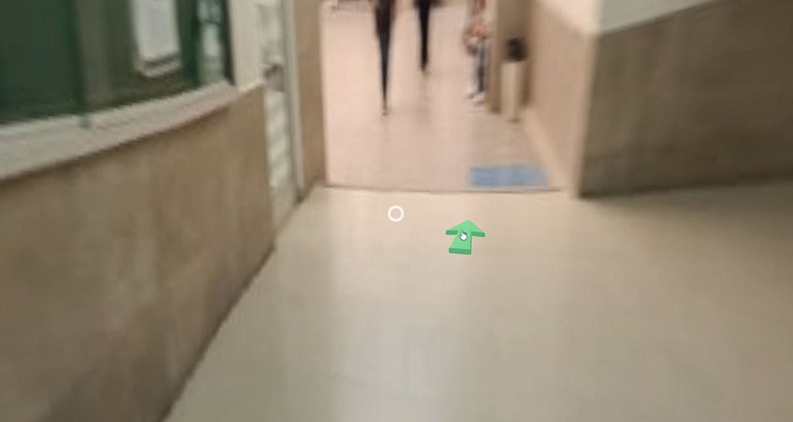
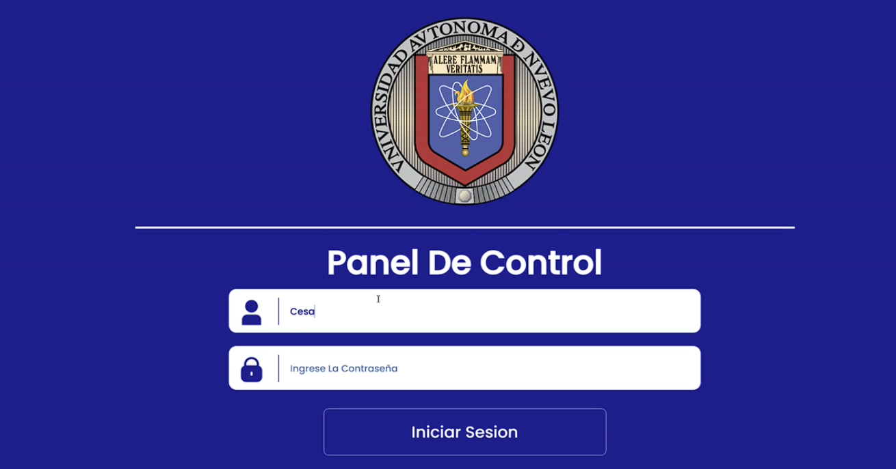
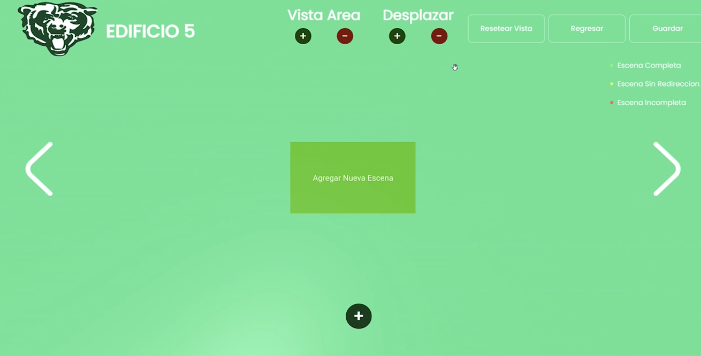

<!--proyect_tittle-->
# 🏫 VR UANL – Web Platform for Interactive Virtual Campus Tours

<!--proyect_image1_proyect_markdown/image1.gif-->

---

<!--proyect_subtitle_description-->
## ✨ Project Description

<!--proyect_content_description-->
**VR UANL** is a web-based platform designed to create and explore **interactive virtual tours** of the Universidad Autónoma de Nuevo León. The system allows administrators to build custom tours using an intuitive interface, integrating panoramic images, points of interest, and smooth navigation through immersive 3D environments.

The application is built with **Vue.js**, using **A-Frame** and **Three.js** for immersive rendering, and **Vuex Store** for state management. The backend is powered by **.NET 8**, with image hosting on a dedicated server and **MySQL** as the database for storing tours and user data.

---

<!--proyect_subtitle_objective-->
## 🎯 Project Objective

<!--proyect_content_objective-->
The main goal of **VR UANL** is to **offer an immersive and accessible experience** for students, visitors, and university staff, allowing them to virtually explore UANL’s facilities from any device.

Additionally, the platform includes an **administration panel** where each department or faculty can create, edit, and manage their own tours—promoting autonomy and personalized content creation.

---

<!--proyect_subtitle_functionality-->
## 🧩 Core Functionality

<!--proyect_content_functionality-->
The platform is composed of the following key modules:

1. **Application intro:** Animated welcome screen with institutional branding and access to the tour.  
2. **Virtual tour viewer:** Free navigation in 3D environments, interactive hotspots, smooth transitions, and VR device compatibility.  
3. **Login panel:** Secure access for administrators using credentials.  
4. **Tour editor:** Visual interface for uploading images, defining points of interest, configuring routes, and saving custom tours.

<!--proyect_image2_proyect_markdown/image2.png-->

<!--proyect_image3_proyect_markdown/image3.png-->

<!--proyect_image4_proyect_markdown/image4.png-->

---

<!--proyect_subtitle_designUX-->
## 🖥️ Design and User Experience

<!--proyect_content_designUX-->
The **VR UANL** interface is designed to be clean, responsive, and user-friendly. The virtual tour offers an immersive experience with intuitive controls, smooth transitions, and compatibility with touchscreens and VR headsets.

The admin panel features guided forms, real-time previews, and visual tools that make tour creation easy—even for users without technical expertise.

---

<!--proyect_subtitle_architecture-->
## 🏗️ Technical Architecture

<!--proyect_content_architecture-->
The system is built on a modern and scalable architecture:

- **Frontend:**  
  - Vue.js  
  - A-Frame for VR environments  
  - Three.js for 3D rendering  
  - Vuex Store for state management  

- **Backend:**  
  - .NET 8 with RESTful API  
  - User authentication and tour management  

- **Infrastructure:**  
  - Dedicated image server for panoramic assets  
  - MySQL database for storing tours and user profiles  
  - Docker for modular deployment and consistent environments

---

<!--proyect_subtitle_technologies-->
## 🔧 Technologies Used

<!--proyect_content_technologies-->
**Frontend:**
- Vue.js  
- A-Frame  
- Three.js  
- Vuex  

**Backend:**
- .NET 8  
- MySQL  
- REST API  

**Infrastructure:**
- Docker  
- Image hosting server  
- Authentication and access control

---

<!--proyect_subtitle_contact-->
## 📬 Contact

<!--proyect_content_contact-->
**Email:**
- vielmassalais023@gmail.com  

**Phone:**
- +52 (81) 3233-1206  

**Social Media:**
- GitHub: [@CesarVielmas](https://github.com/CesarVielmas)  
- LinkedIn: [Cesar Vielmas](https://www.linkedin.com/in/cesar-vielmas-324a9b218/)  

---

<!--proyect_subtitle_footer-->
## VR UANL

<!--proyect_content_footer-->
Explore the university from anywhere 🌐🎓  
**Last updated:** September 3, 2025
